# Pharma Learning Management System Scope Document

## 1. Purpose

This document consolidates the reference material in `/Users/navadeepreddy/pharma_learn/ref` into a single scope and understanding document for a pharmaceutical Learning Management System (LMS), centered on **Caliber EPIQ Learn-IQ** and the wider **EPIQ platform**.

Its purpose is to:

- define what a pharma LMS must do from a business, compliance, process, and technical perspective
- capture the business rules and operating model visible in the URS and user manuals
- explain the module architecture of Learn-IQ within EPIQ
- translate the source documents into a practical scope baseline for solution design, implementation planning, and gap analysis

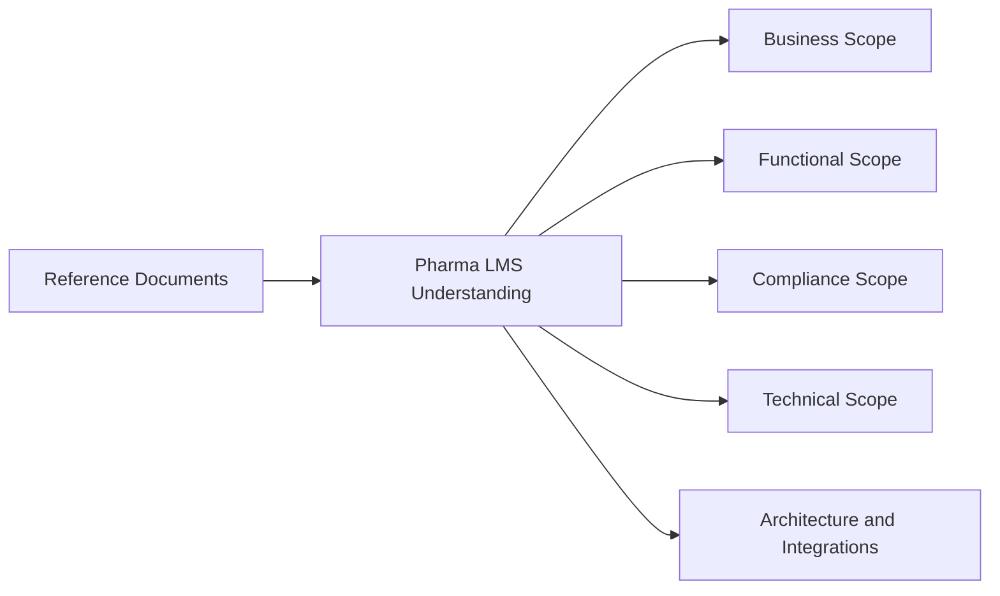

## 2. Source Basis

This document is based on the following reference set:

- `ref/Learn IQ URS.pdf`
- `ref/Learn IQ _ URS.pdf`
- `ref/usermANUAL.pdf`
- `ref/notes.pdf`
- `ref/User Manuals/User Manual Deviation V1.1.pdf`
- `ref/User Manuals/User Manual CAPA  V1.1.pdf`
- `ref/User Manuals/User Manual Change Control V1.4.pdf`
- `ref/NotebookLM Mind Map.png`

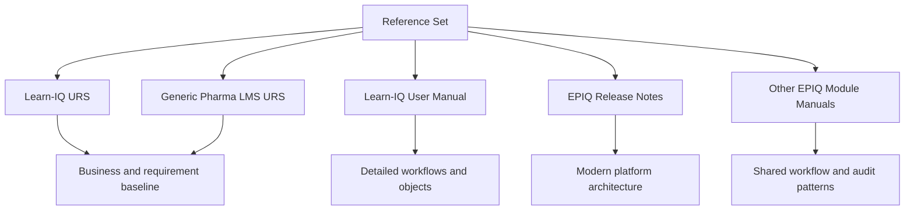

## 3. Executive Understanding

In a pharmaceutical environment, an LMS is not just a training portal. It is a **regulated compliance system** that:

- assigns training according to role, subgroup, department, plant, and job responsibility
- controls document-driven training on SOPs, policies, procedures, and quality content
- supports classroom, document reading, OJT, induction, external training, and blended learning
- enforces qualification, evaluation, retraining, and evidence capture
- provides audit-ready traceability under **21 CFR Part 11**, **EU Annex 11**, cGMP, and CSV expectations
- integrates with enterprise identity and document ecosystems

Learn-IQ, within EPIQ, is best understood as a **training compliance engine** sitting between:

- organizational master data
- document/content control
- training execution and assessment
- compliance evidence, reporting, and audit trails

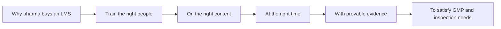

## 4. Scope At A Glance

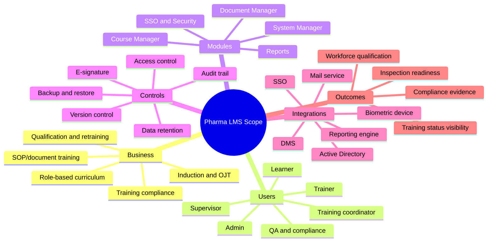

## 5. Business Objective

The source documents consistently position the pharma LMS as a system to:

- manage the full lifecycle of personnel training records
- align training needs to job role and job responsibility
- upload and control training documents, master copies, questionnaires, and answer keys
- identify who must be trained, by when, through which mode, and to what evidence standard
- maintain secure, attributable, contemporaneous, original, and accurate records
- reduce manual effort while improving consistency, control, and inspection readiness

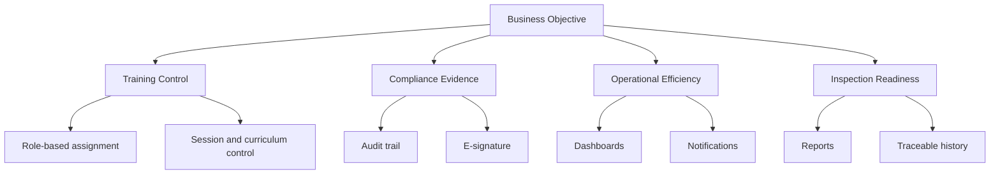

## 6. Business Context In Pharma

### 6.1 Why this system exists

Pharma organizations need to prove that personnel are trained before performing GMP-impacting work. Training is tied to:

- SOP revisions
- induction of new hires
- on-the-job qualification
- periodic refresher training
- role transfers or responsibility changes
- CAPA, deviation, and change-control driven training needs

### 6.2 What makes this different from generic LMS platforms

A pharma LMS must support:

- training as a controlled quality process, not only content consumption
- document-centric and curriculum-centric learning
- approval workflows and e-signature-backed evidence
- training gating before document effectiveness or role readiness
- strong audit trails, reports, and data integrity controls

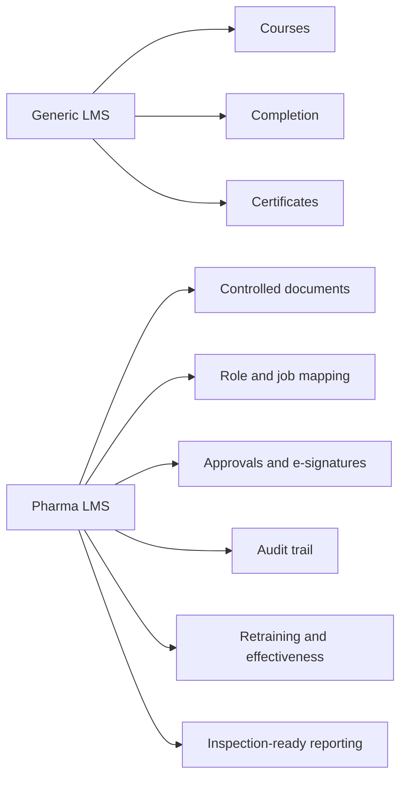

## 7. Product Architecture Context: Learn-IQ Within EPIQ

EPIQ appears in the references as a broader regulated enterprise quality platform. Learn-IQ is one module within that ecosystem, alongside other modules such as docs-iq and assure-iq.

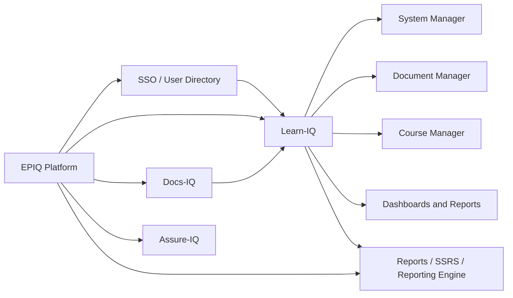

### 7.1 Interpreted role of Learn-IQ

Learn-IQ is the training-management module responsible for:

- user-role driven assignment logic
- training content and document linkage
- schedule and batch/session management
- attendance and assessment
- qualification evidence and history

### 7.2 Interpreted role of EPIQ

Based on the manuals and release notes, EPIQ provides the shared platform services around:

- identity and SSO
- auditability patterns
- approval workflows
- common deployment model
- reporting infrastructure
- module interoperability

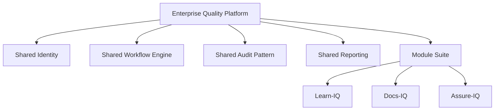

## 8. Functional Scope Baseline

## 8.1 System Manager

System Manager is the administrative and security backbone.

Core capabilities:

- register new roles
- define role hierarchy levels
- set global profiles and permissions
- set user profiles
- register standard reasons and manage their status
- manage groups, subgroups, departments, and job responsibilities
- support fingerprint enrollment and personal settings
- maintain audit trails
- configure mail templates and notifications

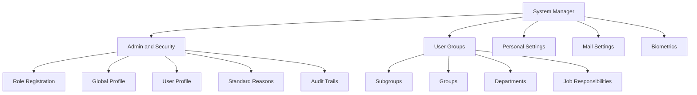

## 8.2 Document Manager

Document Manager handles controlled registration of training-related documents.

Capabilities:

- register and upload documents
- maintain document metadata
- support version-linked visibility
- change active/inactive status
- preserve audit trails on document transactions

In the SP2 manual, Document Manager within Learn-IQ is limited mainly to registration, but it clearly acts as the bridge between controlled documents and training execution.

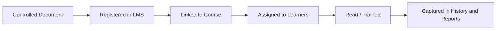

## 8.3 Course Manager

Course Manager is the operational core of the LMS.

Capabilities:

- define topics
- define courses
- register internal and external trainers
- define training venues
- create group training plans
- create interim group training plans
- create training schedules
- manage induction training
- manage OJT completion
- create course sessions
- manage document reading sessions
- generate and respond to question papers
- evaluate answer papers
- run short-term and long-term evaluations
- record offline marks
- trigger course retraining
- maintain training history and related reports

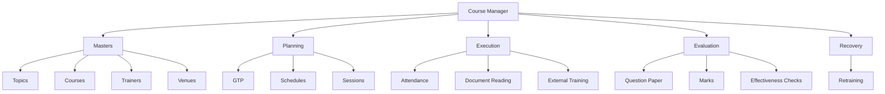

## 8.4 Reporting Layer

The system includes extensive reporting for operational visibility and inspection readiness.

Examples found in the manuals and URS:

- qualified trainer report
- course list report
- date-wise course session report
- individual employee report
- employee training history
- induction training report
- document reading pending report
- OJT completion report
- self-study courses report
- pending training report
- attendance report
- evaluation-related reports

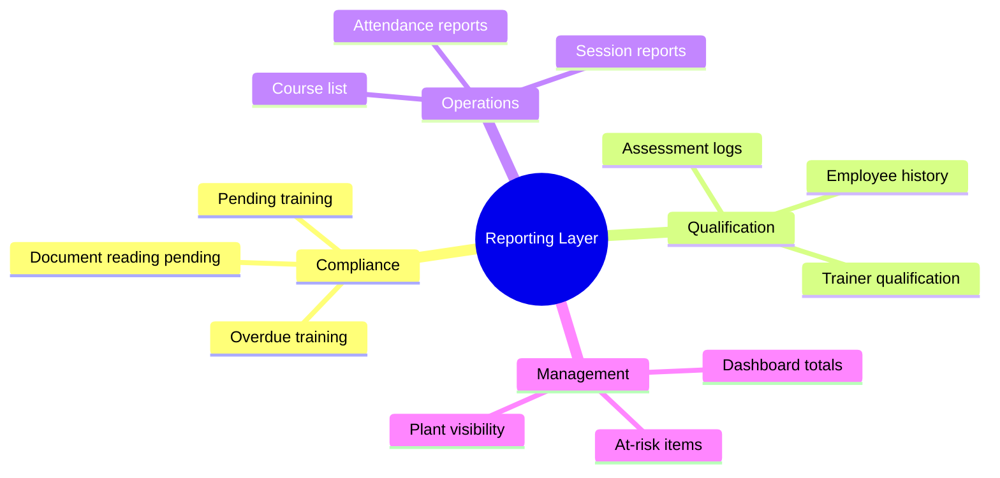

## 9. Key User Personas

| Persona | Primary responsibilities in system |
| --- | --- |
| System Administrator | security, roles, profiles, master setup, policy enforcement |
| Training Coordinator / Site Training Coordinator | schedules, sessions, dashboards, monitoring completion, locked users, assignments |
| Trainer | accepts invitation, conducts training, attendance, evaluation inputs |
| Learner / Trainee | views to-do list, reads documents, attends training, responds to question paper, completes feedback |
| Supervisor / Reporting Manager | evaluates effectiveness, short-term and long-term evaluation |
| QA / Compliance | governance, approvals, inspection readiness, audit review |
| IT / Platform Admin | infrastructure, backup, restore, integration, server availability |

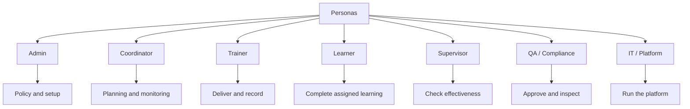

## 10. End-to-End Business Process

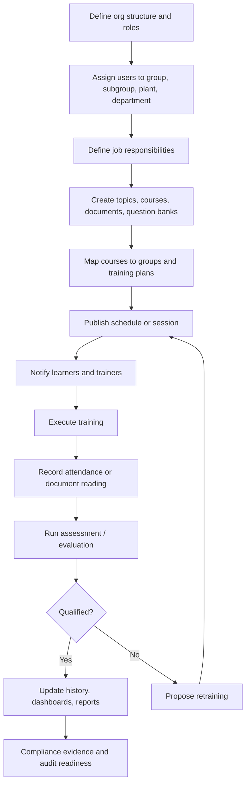

## 11. Core Training Lifecycle

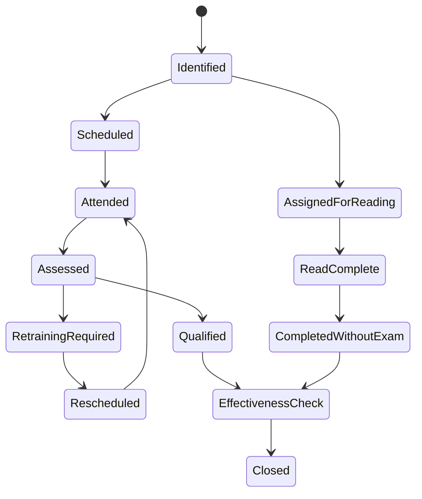

## 12. Business Rules

The following business rules are directly visible or strongly implied by the references.

### 12.1 Role and access rules

- every user must have a unique identity
- duplicate usernames are not allowed
- roles drive global permissions
- user profile must remain a subset of the role-level global profile
- hierarchy level determines approval flow authority
- lower numeric role level indicates higher seniority
- inactive or deactivated users must be blocked from normal use
- user accounts should be disabled rather than deleted

### 12.2 Training assignment rules

- training needs are generated based on job role, subgroup, and job responsibility
- new users should receive an auto-generated to-do list based on defined role/job mapping
- curriculum updates should automatically appear in employee to-do lists
- only users with defined job responsibilities in the plant should be selectable for relevant sessions
- induction training may be mandatory before general training access
- OJT may be mandatory after induction and before regular training access

### 12.3 Document and content rules

- documents must be registered with metadata such as name, code, version, effective date, and review date
- training documents may include SOP copies, master copies, questionnaires, and answer keys
- uploaded content is controlled content, not informal attachments
- document status must support active/inactive control
- training material change history should be retained
- periodic review of training materials should be supported

### 12.4 Session and execution rules

- session types include scheduled, unscheduled, and interim
- training methods include internal classroom, external, shop floor, document reading, and completed training
- delivery may be online or offline
- document reading can be used when evaluation is not required
- actual start and end time of sessions should be captured
- attendance may be manual or biometric
- attendance evidence can include uploaded scanned records

### 12.5 Assessment and qualification rules

- question formats include true/false, fill-in-the-blanks, objective, and descriptive
- random questionnaires must be supported
- evaluation mode may be system-evaluated or manual
- failed or non-qualified users enter retraining flow
- missed question analysis may be provided to qualified learners
- short-term and long-term evaluations support effectiveness checks

### 12.6 Workflow and approval rules

- initiation, modification, and status change can require approval
- re-initiation is allowed after return in many object workflows
- standard reasons and remarks should support controlled justifications
- critical submissions should require confirmation and, where configured, e-signature
- modifications to controlled information should require authorized approval

### 12.7 Compliance and data integrity rules

- audit trail must always be on and not pausable
- audit trail must capture who, what, when, and remarks/reasons where applicable
- audit trail must be protected from deletion or tampering
- e-signatures must be uniquely attributable to one user
- printed and human-readable outputs must reflect signature context where required
- system date/time must be controlled and synchronized
- records must be retrievable, printable, and suitable for inspection
- backup and restore must cover both data and audit trails
- restore testing should be periodically verified

### 12.8 Notification and monitoring rules

- email alerts should be sent for training assignment and session events
- dashboard views should expose pending, in-progress, completed, overdue, and at-risk situations
- review-extension and compliance deadlines should trigger escalation

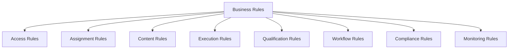

## 13. Process Detail: How Learn-IQ Operates

## 13.1 Organizational setup

1. register roles and define hierarchy
2. define global and user-specific privileges
3. create departments, groups, and subgroups
4. register users and assign plant/group context
5. define and accept job responsibilities

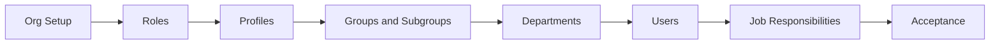

## 13.2 Learning content setup

1. register documents
2. define topics and courses
3. register trainers and venues
4. create question banks and evaluation templates
5. define training plans and schedules

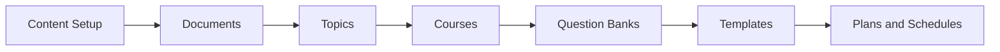

## 13.3 Training execution

1. generate schedule or ad hoc session
2. select subgroup and candidates
3. assign trainer and venue
4. notify stakeholders
5. perform training or document reading
6. record attendance and evidence
7. run assessment and evaluation

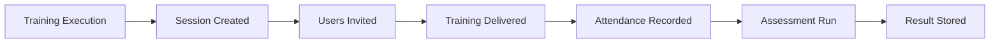

## 13.4 Post-training compliance

1. determine qualification result
2. update employee history
3. route retraining if required
4. record effectiveness checks
5. expose results in reports and dashboards

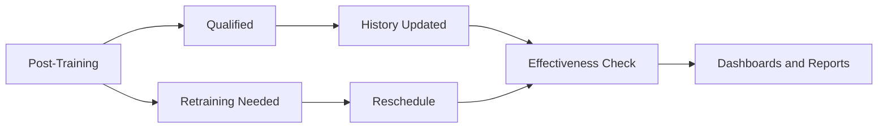

## 14. Architecture Understanding

## 14.1 Logical architecture

```mermaid
flowchart TB
    U["Users: Admins, Coordinators, Trainers, Learners, QA"] --> UI["Web Client / Browser UI"]
    UI --> APP["EPIQ Application Layer / Learn-IQ Module"]
    APP --> WF["Workflow, Approval, Audit and Rules Engine"]
    APP --> REP["Reports / SSRS / Report Engine"]
    APP --> DMS["Document Repository / Object Storage / DMS"]
    APP --> ID["SSO / AD / User Directory"]
    APP --> MAIL["Mail Service"]
    APP --> BIO["Biometric Integration"]
    APP --> DB["SQL Database"]
```

### 14.1.1 Application-layer responsibilities

- user interaction and dashboards
- module workflows
- session scheduling
- training execution
- audit capture
- rules enforcement

### 14.1.2 Data-layer responsibilities

- master data
- user and role data
- course and document metadata
- schedule and attendance records
- assessment and qualification records
- audit trails
- reportable history

### 14.1.3 Integration-layer responsibilities

- identity synchronization with AD/SSO
- mail notification delivery
- reporting services
- document storage access
- optional biometric attendance capture

```mermaid
flowchart LR
    A["Users"] --> B["Browser"]
    B --> C["Learn-IQ App"]
    C --> D["Workflow and Audit"]
    C --> E["Database"]
    C --> F["Document Storage"]
    C --> G["Mail Service"]
    C --> H["SSO / AD"]
    C --> I["Report Engine"]
    C --> J["Biometric Device"]
```

## 14.2 Deployment architecture from references

The reference set shows two broad platform generations:

- **SP2 / older Learn-IQ baseline**
- **EPIQ 3.1.07 newer release direction**

### 14.2.1 Older SP2 baseline

| Layer | Reference baseline |
| --- | --- |
| Server OS | Windows Server 2016 |
| Web server | IIS 7.0 or higher |
| Framework | .NET Framework 4.0 |
| Database | SQL Server 2014 / 2016 |
| Browser | Internet Explorer 11 |
| App model | server-hosted web application |

### 14.2.2 Newer EPIQ direction from release note

| Layer | Newer recommendation |
| --- | --- |
| Server OS | Windows Server 2019 or higher |
| Web server | IIS 10 |
| Framework | .NET Core 9 |
| Database | SQL Server 2019 or higher, SQL Server 2022 recommended for new installs |
| Browser | latest Chrome / Microsoft Edge |
| Reporting | SSRS |
| Extra components | mail services, IQM engine, object storage folder, CCC print component |

### 14.2.3 Single server vs multi-server

The newer release note supports:

- single server deployment for smaller environments
- split application and database servers for production multi-server environments

```mermaid
flowchart LR
    A["Deployment Options"] --> B["Single Server"]
    A --> C["Multi-Server"]
    B --> B1["App + DB + Reporting together"]
    C --> C1["Application Server"]
    C --> C2["Database Server"]
    C --> C3["Shared services"]
```

## 14.3 Architecture interpretation

The EPIQ platform is best understood as a **Windows-hosted modular enterprise web application** with:

- browser clients
- IIS-hosted module services
- SQL-backed persistence
- centralized reporting
- SSO-linked identity model
- optional file/object storage for attachments and documents

```mermaid
mindmap
  root((Architecture Interpretation))
    Hosting
      Windows Server
      IIS
    Application
      Modular platform
      Learn-IQ module
    Data
      SQL database
      Audit records
      Training records
    Integration
      SSO and AD
      Mail
      Reports
      Storage
    Edge Components
      Browser
      Biometric device
      Print utility
```

## 15. Integration Scope

## 15.1 Identity and access

- Active Directory integration for user information and password-related synchronization
- SSO as a central user profile and module-assignment source
- role-based authorization within Learn-IQ

## 15.2 Document management

- integration with DMS is explicitly mentioned in one URS
- documents are linked to training rather than existing as standalone learning assets only

## 15.3 Mail and alerts

- mail templates and mail execution service support notifications, escalations, and reminders

## 15.4 Biometrics

- fingerprint enrollment and biometric attendance are supported for some usage modes

## 15.5 Reporting and printing

- SSRS/report engine for formal reports
- client print utility support for attached documents and print workflows

```mermaid
flowchart TD
    A["Integration Scope"] --> B["Identity"]
    A --> C["Documents"]
    A --> D["Mail"]
    A --> E["Biometrics"]
    A --> F["Reporting"]
    B --> B1["AD"]
    B --> B2["SSO"]
    C --> C1["DMS"]
    D --> D1["Notifications"]
    E --> E1["Attendance capture"]
    F --> F1["SSRS and print services"]
```

## 16. Compliance Scope

```mermaid
flowchart LR
    A["21 CFR Part 11"] --> B["Unique user IDs"]
    A --> C["Electronic signatures"]
    A --> D["Computer-generated audit trails"]
    A --> E["Record retention and retrieval"]
    A --> F["Authority checks"]

    G["EU Annex 11"] --> H["Security"]
    G --> I["Business continuity"]
    G --> J["Data integrity"]
    G --> K["Access control"]
    G --> L["Periodic review"]
```

### 16.1 Core compliance features expected in scope

- unique user authentication
- password policy and periodic reset
- user deactivation without silent record loss
- controlled e-signatures
- complete audit history
- printable inspection records
- backup, restore, and restore verification
- protection against unauthorized data manipulation
- retention and archival handling
- time synchronization and traceable chronology

### 16.2 Compliance-adjacent quality expectations

Though not all are deeply elaborated in Learn-IQ itself, the reference set implies support for:

- CSV / qualification evidence
- risk-based control expectations
- record lifecycle governance
- periodic review practices

```mermaid
flowchart TD
    A["Compliance Scope"] --> B["Identity Control"]
    A --> C["Record Control"]
    A --> D["Signature Control"]
    A --> E["Audit Control"]
    A --> F["Continuity Control"]
    B --> B1["Unique user IDs"]
    C --> C1["Retention and retrieval"]
    D --> D1["E-signatures"]
    E --> E1["Immutable audit trail"]
    F --> F1["Backup and restore"]
```

## 17. Reporting And Analytics Scope

The pharma LMS reporting scope is broader than learner progress dashboards. It includes:

- training compliance status
- overdue and at-risk training
- pending document reading
- trainer qualification
- employee history and qualification evidence
- induction and OJT progress
- session logs and attendance
- assessment release and extension logs
- curriculum/version views
- credit request status and completion totals

### 17.1 Dashboard expectations from the references

- total ongoing assignments
- at-risk vs not-at-risk assignments
- overdue items
- active users
- active user groups
- training item totals
- curriculum totals
- completion totals
- locked users and locked quiz/exam visibility

```mermaid
flowchart LR
    A["Analytics Scope"] --> B["Operational Monitoring"]
    A --> C["Compliance Monitoring"]
    A --> D["Qualification Monitoring"]
    A --> E["Management Visibility"]
    B --> B1["Schedules / sessions / attendance"]
    C --> C1["Pending / overdue / at-risk"]
    D --> D1["History / trainer qualification / exams"]
    E --> E1["Totals / trends / dashboards"]
```

## 18. Suggested Scope Model For A New Pharma LMS

If this document is used to define a target product scope, the source material supports the following capability layers.

## 18.1 Foundational scope

- user, role, hierarchy, and plant model
- groups, subgroups, departments, job responsibilities
- global/user profile security
- SSO and password policies
- audit trail and e-signature framework

## 18.2 Learning operations scope

- topic and course master data
- document registration and linkage
- trainer and venue management
- schedules, sessions, attendance, document reading
- online/offline training support
- induction and OJT

## 18.3 Qualification scope

- question banks and question papers
- system and manual evaluation
- qualification decisioning
- retraining loop
- effectiveness evaluation

## 18.4 Compliance scope

- validation-friendly controls
- immutable audit evidence
- records lifecycle and retention support
- backup/restore readiness
- inspection-ready reporting

## 18.5 Enterprise scope

- DMS integration
- reporting engine
- mail service
- biometric attendance
- platform monitoring and operational administration

```mermaid
flowchart TD
    A["Target Scope Model"] --> B["Foundational"]
    A --> C["Learning Operations"]
    A --> D["Qualification"]
    A --> E["Compliance"]
    A --> F["Enterprise"]
```

## 19. Recommended Work Breakdown For Scope Definition

```mermaid
flowchart TD
    A["Scope Definition"] --> B["Business Process Scope"]
    A --> C["Functional Scope"]
    A --> D["Compliance Scope"]
    A --> E["Technical Scope"]
    A --> F["Integration Scope"]
    A --> G["Reporting Scope"]

    B --> B1["Training lifecycle"]
    B --> B2["Role and job mapping"]
    B --> B3["Induction / OJT / refresher"]

    C --> C1["System Manager"]
    C --> C2["Document Manager"]
    C --> C3["Course Manager"]
    C --> C4["Dashboards"]

    D --> D1["Part 11"]
    D --> D2["Annex 11"]
    D --> D3["Audit trail"]
    D --> D4["E-signature"]

    E --> E1["Deployment"]
    E --> E2["Security"]
    E --> E3["Performance"]
    E --> E4["Backup and restore"]
```

## 20. Non-Functional Requirements

The references point to the following NFR categories.

### 20.1 Security

- role-based access control
- restricted logical access
- password complexity, rotation, and reset
- invalid login control
- session timeout
- date/time control

### 20.2 Reliability

- backup and restore capability
- periodic restore verification
- power failure / recovery considerations
- business continuity provisions

### 20.3 Performance and usability

- multi-facility support
- moderate-skill user accessibility
- searchable list screens
- dashboard and graphical reporting

### 20.4 Maintainability

- configuration-driven approvals
- standard reasons
- reusable templates
- version-synchronized module operations

### 20.5 Traceability

- unique identifiers for records
- user session logs
- printable reports
- record history and change history

```mermaid
mindmap
  root((Non-Functional Requirements))
    Security
      RBAC
      Password policy
      Session timeout
    Reliability
      Backup
      Restore
      Continuity
    Performance
      Multi-site support
      Searchability
      Dashboard responsiveness
    Maintainability
      Config-driven behavior
      Version alignment
    Traceability
      IDs
      Logs
      History
```

## 21. Risks And Design Implications

### 21.1 Business risks if underscoped

- untrained staff performing GMP tasks
- inability to prove training completion at inspection
- gaps between SOP revision and training assignment
- missing retraining loop for failed assessment

### 21.2 Technical risks if underscoped

- audit trails captured inconsistently across modules
- identity mismatches between AD, SSO, and LMS
- broken evidence chain between document version and trained version
- weak reporting for QA and audit

### 21.3 Compliance risks if underscoped

- non-compliant e-signature flows
- record deletion or silent overwrites
- inability to restore records with audit context
- insufficient attribution, timestamping, or retention

```mermaid
flowchart TD
    A["Underscoping Risk"] --> B["Business Failure"]
    A --> C["Technical Failure"]
    A --> D["Compliance Failure"]
    B --> B1["Untrained workforce"]
    B --> B2["Missed assignments"]
    C --> C1["Broken integrations"]
    C --> C2["Weak reporting"]
    D --> D1["Failed inspection"]
    D --> D2["Invalid evidence chain"]
```

## 22. Open Questions For Final URS/Scope Freeze

The references are rich, but a final implementation scope would still need these decisions:

- should document control remain lightweight in LMS or rely more heavily on a dedicated DMS/docs module?
- which training modes are mandatory at go-live: ILT, document reading, external, OJT, blended, self-study, SCORM?
- should biometric attendance be in scope?
- what is the target authority model for approvals: serial, parallel, plant-specific, or transaction-specific?
- what are the exact retention and archival periods for training records?
- how tightly should training completion gate document effectiveness or work authorization?
- what reporting must be inspection-ready on day one?
- which deployment model is desired: single server, multi-server, or cloud-modernized equivalent?

```mermaid
flowchart LR
    A["Scope Freeze Questions"] --> B["Business"]
    A --> C["Compliance"]
    A --> D["Technology"]
    A --> E["Operations"]
    B --> B1["Training modes"]
    C --> C1["Retention / approvals / evidence"]
    D --> D1["Deployment / integrations"]
    E --> E1["Reporting / support model"]
```

## 23. Final Conclusion

The reference set shows that a **pharma LMS is a compliance-critical quality system**, not merely a course-delivery tool. Learn-IQ within EPIQ is designed around:

- organizational role and responsibility mapping
- controlled training content and document linkage
- scheduling, attendance, and evidence capture
- qualification, evaluation, and retraining
- auditability, e-signatures, and inspection-grade reporting

The correct scope for a pharma LMS must therefore span:

- **business process control**
- **regulated data and records control**
- **training operations**
- **quality and compliance assurance**
- **enterprise platform architecture**

Any scope document or implementation plan that treats the LMS only as learner content delivery would miss the central regulated purpose demonstrated by the reference material.

```mermaid
flowchart LR
    A["Pharma LMS"] --> B["People readiness"]
    A --> C["Process control"]
    A --> D["Evidence and compliance"]
    A --> E["Technology platform"]
    B --> F["Qualified workforce"]
    C --> F
    D --> F
    E --> F
```

## 24. Appendix: Quick Traceability Map

| Topic | Primary source signals |
| --- | --- |
| business purpose of Learn-IQ | Encube URS, SP2 user manual preface |
| generic pharma LMS control expectations | Alfa Biomed URS |
| module structure and workflows | SP2 user manual |
| platform direction and newer technical baseline | EPIQ 3.1.07 release notes |
| wider EPIQ workflow and audit behavior | deviation, CAPA, and change control manuals |

```mermaid
flowchart TD
    A["Traceability"] --> B["Encube URS"]
    A --> C["Alfa URS"]
    A --> D["SP2 Manual"]
    A --> E["Release Notes"]
    A --> F["Other Module Manuals"]
```

## 25. Analyst Notes

- The SP2 user manual gives the clearest functional decomposition of Learn-IQ.
- The Encube URS is strongest for role-based training, dashboard expectations, and high-level business rules.
- The Alfa Biomed URS is strongest for compliance, security, and generalized pharma LMS expectations.
- The release note indicates platform modernization from older .NET/IE-era deployment toward newer Windows Server, IIS 10, SQL 2019+, Chrome/Edge, and shared SSO/reporting architecture.
- The deviation/CAPA/change-control manuals help confirm that EPIQ uses common workflow, e-signature, and audit paradigms across modules, which is useful when defining enterprise-wide architecture and governance assumptions.

```mermaid
flowchart LR
    A["How to read this document"] --> B["Start with business context"]
    B --> C["Move to modules and workflows"]
    C --> D["Then study rules and compliance"]
    D --> E["Finish with architecture and scope model"]
```
