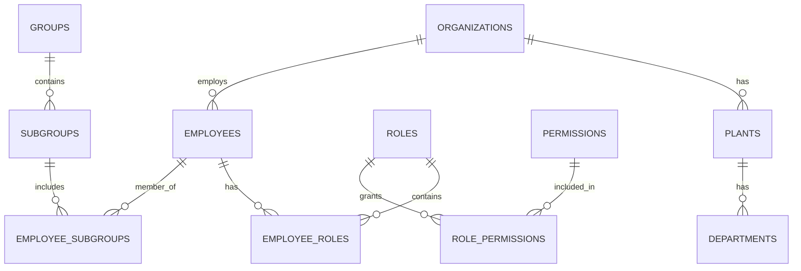
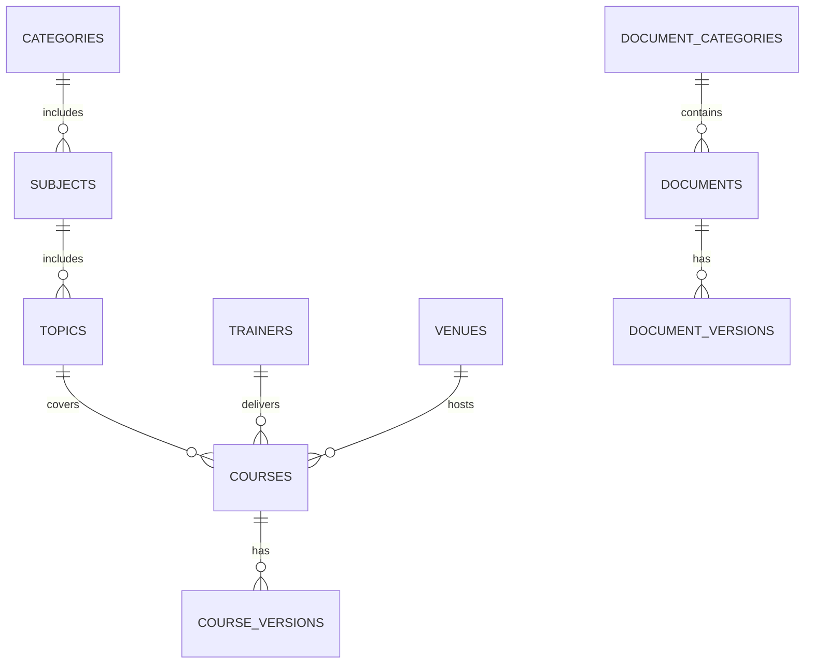
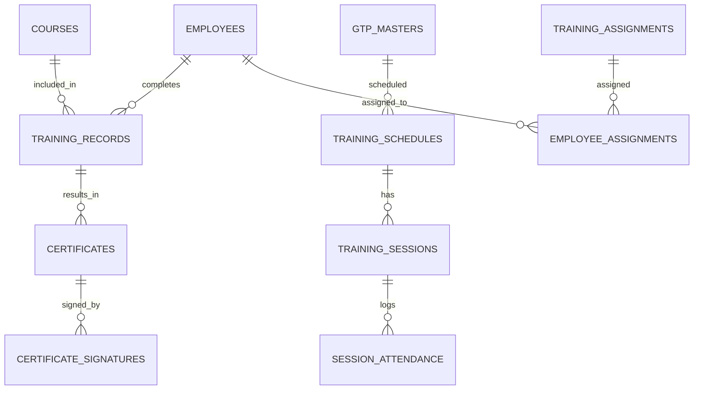
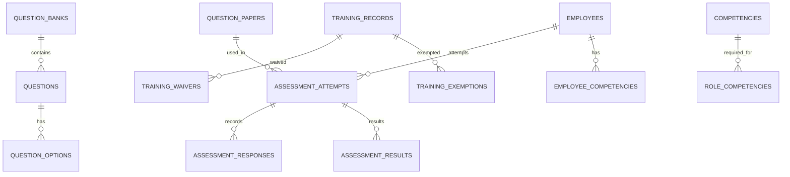
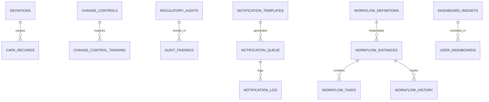
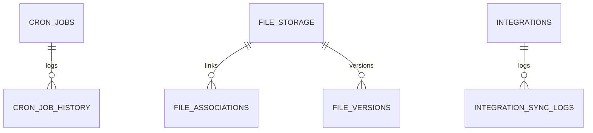

# PharmaLearn LMS – Complete ERD & Object Model
#
---

## Module Coverage Checklist

The following 17 modules are fully represented in the schema and ERD:

1. Organization
2. Identity & Access
3. Documents
4. Courses
5. Training
6. Assessment
7. Compliance
8. Quality
9. Audit
10. Notifications
11. Analytics
12. Workflow
13. Cron & Infrastructure
14. Policies
15. Edge Functions
16. Versioning & History
17. Integrations

Each module below is shown as a tile group, with all objects and properties, including join tables and relationships.


## Visual Object Model (Big Canvas)

Below is a comprehensive, visual representation of all major objects (tables) in the PharmaLearn LMS backend. Each tile is a table/entity, grouped by domain. Join tables and core relationships are highlighted. Naming conventions use plural, snake_case, and all foreign keys are UUIDs.

---

## ERD Tiles (All Objects)
---
### Naming Conventions & Relationship Patterns

- All table names are plural, snake_case (e.g., `employees`, `training_sessions`).
- All primary keys are `id` (UUID, PK).
- All foreign keys are snake_case, referencing the parent table (e.g., `employee_id`, `role_id`).
- Join tables are named as `entity1_entity2` (alphabetical order, plural if needed).
- Versioned tables use a `*_versions` suffix (e.g., `document_versions`).
- Append-only audit/history tables use a `_history` or `_audit` suffix.
- All regulated objects have versioning and audit trails.
- All relationships are explicit via FKs or join tables (no implicit many-to-many).


<details>
<summary>Click to expand/collapse full object list</summary>

### Organization
```
[organizations]
- id (PK)
- name
- unique_code
- ...

[plants]
- id (PK)
- organization_id (FK)
- name
- ...

[departments]
- id (PK)
- organization_id (FK)
- plant_id (FK)
- name
- ...
```

### Identity & Access
```
[roles]
- id (PK)
- organization_id (FK)
- name
- level
- ...

[role_categories]
- id (PK)
- organization_id (FK)
- name
- ...

[permissions]
- id (PK)
- organization_id (FK)
- name
- ...

[role_permissions] (join)
- id (PK)
- role_id (FK)
- permission_id (FK)

[employees]
- id (PK)
- organization_id (FK)
- user_id (FK)
- ...

[employee_roles] (join)
- id (PK)
- employee_id (FK)
- role_id (FK)

[groups]
- id (PK)
- organization_id (FK)
- name
- ...

[subgroups]
- id (PK)
- group_id (FK)
- name
- ...

[employee_subgroups] (join)
- id (PK)
- employee_id (FK)
- subgroup_id (FK)

[job_responsibilities]
- id (PK)
- employee_id (FK)
- responsibility
- ...

[biometric]
- id (PK)
- employee_id (FK)
- ...
```

### Documents
```
[document_categories]
- id (PK)
- name
- ...

[documents]
- id (PK)
- organization_id (FK)
- category_id (FK)
- ...

[document_versions]
- id (PK)
- document_id (FK)
- version_number
- ...
```

### Courses
```
[categories]
- id (PK)
- name
- ...

[subjects]
- id (PK)
- category_id (FK)
- name
- ...

[topics]
- id (PK)
- subject_id (FK)
- name
- ...

[courses]
- id (PK)
- organization_id (FK)
- topic_id (FK)
- ...

[course_versions]
- id (PK)
- course_id (FK)
- version_number
- ...

[trainers]
- id (PK)
- employee_id (FK)
- ...

[venues]
- id (PK)
- name
- location
- ...

[feedback_templates]
- id (PK)
- ...
```

### Training
```
[gtp_masters]
- id (PK)
- ...

[training_schedules]
- id (PK)
- gtp_id (FK)
- ...

[training_sessions]
- id (PK)
- schedule_id (FK)
- ...

[training_batches]
- id (PK)
- session_id (FK)
- ...

[training_invitations]
- id (PK)
- session_id (FK)
- employee_id (FK)
- ...

[session_attendance]
- id (PK)
- session_id (FK)
- employee_id (FK)
- ...

[daily_attendance_summary]
- id (PK)
- ...

[training_attendance_totals]
- id (PK)
- ...

[induction_programs]
- id (PK)
- ...

[induction_modules]
- id (PK)
- program_id (FK)
- ...

[employee_induction]
- id (PK)
- employee_id (FK)
- program_id (FK)
- ...

[employee_induction_progress]
- id (PK)
- employee_induction_id (FK)
- module_id (FK)
- ...

[ojt_masters]
- id (PK)
- ...

[ojt_tasks]
- id (PK)
- ojt_master_id (FK)
- ...

[employee_ojt]
- id (PK)
- employee_id (FK)
- ojt_master_id (FK)
- ...

[ojt_task_completion]
- id (PK)
- employee_ojt_id (FK)
- ojt_task_id (FK)
- ...

[self_learning_assignments]
- id (PK)
- ...

[learning_progress]
- id (PK)
- ...

[content_view_tracking]
- id (PK)
- ...

[training_feedback]
- id (PK)
- ...

[trainer_feedback]
- id (PK)
- ...

[training_effectiveness]
- id (PK)
- ...

[feedback_summary]
- id (PK)
- ...
```

### Assessment
```
[question_bank_categories]
- id (PK)
- ...

[question_banks]
- id (PK)
- category_id (FK)
- ...

[questions]
- id (PK)
- question_bank_id (FK)
- ...

[question_options]
- id (PK)
- question_id (FK)
- ...

[question_blanks]
- id (PK)
- question_id (FK)
- ...

[question_matching_pairs]
- id (PK)
- question_id (FK)
- ...

[question_papers]
- id (PK)
- ...

[question_paper_sections]
- id (PK)
- question_paper_id (FK)
- ...

[question_paper_questions] (join)
- id (PK)
- question_paper_id (FK)
- question_id (FK)

[assessment_attempts]
- id (PK)
- question_paper_id (FK)
- employee_id (FK)
- ...

[assessment_responses]
- id (PK)
- attempt_id (FK)
- question_id (FK)
- ...

[assessment_activity_log]
- id (PK)
- ...

[assessment_results]
- id (PK)
- attempt_id (FK)
- ...

[grading_queue]
- id (PK)
- ...

[result_appeals]
- id (PK)
- ...
```

### Compliance
```
[training_records]
- id (PK)
- employee_id (FK)
- course_id (FK)
- gtp_id (FK)
- ...

[training_record_items]
- id (PK)
- training_record_id (FK)
- ...

[certificate_templates]
- id (PK)
- ...

[certificates]
- id (PK)
- training_record_id (FK)
- ...

[certificate_signatures]
- id (PK)
- certificate_id (FK)
- ...

[certificate_verifications]
- id (PK)
- certificate_id (FK)
- ...

[training_assignments]
- id (PK)
- ...

[employee_assignments] (join)
- id (PK)
- employee_id (FK)
- assignment_id (FK)

[training_matrix]
- id (PK)
- ...

[training_matrix_items]
- id (PK)
- matrix_id (FK)
- ...

[training_waivers]
- id (PK)
- ...

[waiver_approval_history]
- id (PK)
- waiver_id (FK)
- ...

[training_exemptions]
- id (PK)
- ...

[exemption_employees] (join)
- id (PK)
- exemption_id (FK)
- employee_id (FK)

[competencies]
- id (PK)
- ...

[role_competencies] (join)
- id (PK)
- role_id (FK)
- competency_id (FK)

[employee_competencies] (join)
- id (PK)
- employee_id (FK)
- competency_id (FK)

[competency_history]
- id (PK)
- ...

[competency_gaps]
- id (PK)
- ...
```

### Quality
```
[deviations]
- id (PK)
- ...

[capa_records]
- id (PK)
- deviation_id (FK)
- ...

[deviation_training_requirements]
- id (PK)
- deviation_id (FK)
- ...

[change_controls]
- id (PK)
- ...

[change_control_training]
- id (PK)
- change_control_id (FK)
- ...

[change_control_training_status]
- id (PK)
- change_control_training_id (FK)
- ...

[regulatory_audits]
- id (PK)
- ...

[audit_findings]
- id (PK)
- regulatory_audit_id (FK)
- ...

[audit_finding_training]
- id (PK)
- audit_finding_id (FK)
- ...

[audit_preparation_items]
- id (PK)
- regulatory_audit_id (FK)
- ...
```

### Audit
```
[login_audit_trail]
- id (PK)
- ...

[security_audit_trail]
- id (PK)
- ...

[data_access_audit]
- id (PK)
- ...

[permission_change_audit]
- id (PK)
- ...

[system_config_audit]
- id (PK)
- ...

[compliance_reports]
- id (PK)
- ...

[compliance_snapshots]
- id (PK)
- ...

[regulatory_submissions]
- id (PK)
- ...

[annual_training_plans]
- id (PK)
- ...
```

### Notifications
```
[notification_templates]
- id (PK)
- ...

[notification_queue]
- id (PK)
- ...

[notification_log]
- id (PK)
- ...

[user_notifications]
- id (PK)
- ...

[notification_preferences]
- id (PK)
- ...

[reminder_rules]
- id (PK)
- ...

[scheduled_reminders]
- id (PK)
- ...

[escalation_rules]
- id (PK)
- ...

[active_escalations]
- id (PK)
- ...

[escalation_history]
- id (PK)
- ...
```

### Analytics
```
[dashboard_widgets]
- id (PK)
- ...

[user_dashboards]
- id (PK)
- ...

[training_analytics]
- id (PK)
- ...

[course_analytics]
- id (PK)
- ...

[employee_training_analytics]
- id (PK)
- ...
```

### Workflow
```
[workflow_definitions]
- id (PK)
- ...

[workflow_approval_rules]
- id (PK)
- workflow_definition_id (FK)
- ...

[workflow_instances]
- id (PK)
- workflow_definition_id (FK)
- ...

[workflow_tasks]
- id (PK)
- workflow_instance_id (FK)
- ...

[workflow_history]
- id (PK)
- workflow_instance_id (FK)
- ...

[approval_delegations]
- id (PK)
- ...

[delegation_actions]
- id (PK)
- approval_delegation_id (FK)
- ...

[out_of_office]
- id (PK)
- ...

[parallel_approval_groups]
- id (PK)
- ...
```

### Cron & Infrastructure

```
[cron_jobs]
- id (PK)
- name
- schedule
- command
- status
- created_at
- updated_at

[cron_job_history]
- id (PK)
- cron_job_id (FK)
- run_at
- status
- output
- error

[background_tasks]
- id (PK)
- name
- status
- started_at
- completed_at
- result

[system_settings]
- id (PK)
- key
- value
- description
- updated_at

[feature_flags]
- id (PK)
- key
- enabled
- description
- created_at
- updated_at

[api_keys]
- id (PK)
- key
- description
- created_by
- created_at
- expires_at
- status

[webhooks]
- id (PK)
- url
- event
- secret
- status
- created_at

[webhook_deliveries]
- id (PK)
- webhook_id (FK)
- delivered_at
- status
- response_code
- response_body

[file_storage]
- id (PK)
- file_name
- file_path
- file_size
- mime_type
- uploaded_by
- uploaded_at

[file_associations]
- id (PK)
- file_id (FK)
- entity_type
- entity_id

[media_transcoding_jobs]
- id (PK)
- file_id (FK)
- status
- started_at
- completed_at
- output_path

[file_versions]
- id (PK)
- file_id (FK)
- version_number
- created_at
- created_by

[temporary_files]
- id (PK)
- file_name
- file_path
- expires_at
- uploaded_by
- uploaded_at

[integrations]
- id (PK)
- name
- type
- config
- status
- created_at

[integration_sync_logs]
- id (PK)
- integration_id (FK)
- synced_at
- status
- details

[external_id_mappings]
- id (PK)
- external_system
- external_id
- internal_table
- internal_id

[sso_configurations]
- id (PK)
- provider
- client_id
- client_secret
- redirect_uri
- scopes
- status
- created_at
```

</details>


---

#### Summary: All Join Tables

| Join Table                | Properties (PK, FKs, etc.)                                  |
|---------------------------|-------------------------------------------------------------|
| role_permissions          | id (PK), role_id (FK), permission_id (FK)                   |
| employee_roles            | id (PK), employee_id (FK), role_id (FK)                     |
| employee_subgroups        | id (PK), employee_id (FK), subgroup_id (FK)                 |
| group_subgroups           | id (PK), group_id (FK), subgroup_id (FK)                    |
| session_attendance        | id (PK), session_id (FK), employee_id (FK)                  |
| employee_induction        | id (PK), employee_id (FK), program_id (FK)                  |
| employee_induction_progress| id (PK), employee_induction_id (FK), module_id (FK)        |
| employee_ojt              | id (PK), employee_id (FK), ojt_master_id (FK)               |
| ojt_task_completion       | id (PK), employee_ojt_id (FK), ojt_task_id (FK)             |
| question_paper_questions  | id (PK), question_paper_id (FK), question_id (FK)           |
| assessment_responses      | id (PK), attempt_id (FK), question_id (FK)                  |
| employee_assignments      | id (PK), employee_id (FK), assignment_id (FK)               |
| exemption_employees       | id (PK), exemption_id (FK), employee_id (FK)                |
| role_competencies         | id (PK), role_id (FK), competency_id (FK)                   |
| employee_competencies     | id (PK), employee_id (FK), competency_id (FK)               |
| file_associations         | id (PK), file_id (FK), entity_type, entity_id               |
| file_versions             | id (PK), file_id (FK), version_number, created_at, created_by|
| integration_sync_logs     | id (PK), integration_id (FK), synced_at, status, details    |
| external_id_mappings      | id (PK), external_system, external_id, internal_table, internal_id |

---

## Big Canvas ERD Diagram (ASCII/Markdown)

<pre>
┌──────────────┐      ┌──────────────┐      ┌──────────────┐
│ organizations│─────│   plants     │─────▶│ departments  │
└──────────────┘      └──────────────┘      └──────────────┘
	│
	▼
┌──────────────┐      ┌──────────────┐      ┌──────────────┐
│   employees  │◀────▶│ employee_roles│◀───▶│   roles      │
└──────────────┘      └──────────────┘      └──────────────┘
	│
	▼
┌──────────────┐      ┌──────────────┐      ┌──────────────┐
│ employee_subg│◀────▶│ subgroups    │◀────▶│ groups       │
└──────────────┘      └──────────────┘      └──────────────┘
	│
	▼
┌──────────────┐      ┌──────────────┐      ┌──────────────┐
│training_recs │◀────▶│training_assign│────▶│  courses     │
└──────────────┘      └──────────────┘      └──────────────┘
	│
	▼
┌──────────────┐      ┌──────────────┐      ┌──────────────┐
│ certificates │◀────▶│certificate_sgn│────▶│  employees   │
└──────────────┘      └──────────────┘      └──────────────┘
	│
	▼
┌──────────────┐      ┌──────────────┐      ┌──────────────┐
│  documents   │─────▶│doc_versions  │─────▶│doc_categories│
└──────────────┘      └──────────────┘      └──────────────┘
	│
	▼
┌──────────────┐      ┌──────────────┐      ┌──────────────┐
│assessments   │◀────▶│assessment_res│────▶│  questions    │
└──────────────┘      └──────────────┘      └──────────────┘
	│
	▼
┌──────────────┐      ┌──────────────┐      ┌──────────────┐
│ notifications│─────▶│notif_queue   │────▶│ notif_log     │
└──────────────┘      └──────────────┘      └──────────────┘
	│
	▼
┌──────────────┐      ┌──────────────┐      ┌──────────────┐
│ workflow     │─────▶│workflow_tasks│────▶│workflow_hist  │
└──────────────┘      └──────────────┘      └──────────────┘
	│
	▼
┌──────────────┐      ┌──────────────┐      ┌──────────────┐
│ analytics    │─────▶│dashboards    │────▶│reports        │
└──────────────┘      └──────────────┘      └──────────────┘
	│
	▼
┌──────────────┐      ┌──────────────┐      ┌──────────────┐
│ cron_jobs    │─────▶│cron_history  │      │ background_tsk│
└──────────────┘      └──────────────┘      └──────────────┘
	│
	▼
┌──────────────┐      ┌──────────────┐      ┌──────────────┐
│ file_storage │─────▶│file_versions │────▶│file_assoc     │
└──────────────┘      └──────────────┘      └──────────────┘
	│
	▼
┌──────────────┐      ┌──────────────┐      ┌──────────────┐
│ integrations │─────▶│integration_log│────▶│external_id_mp│
└──────────────┘      └──────────────┘      └──────────────┘
</pre>

Legend: ─── 1-to-many, ◀──▶ many-to-many (join), arrows show FK direction. Table names are abbreviated for space; see tiles above for full names.

----

## Visual ERD (Mermaid Diagrams)

> These diagrams provide an interactive, visual overview of the core object model and relationships. Paste into a Mermaid-enabled Markdown viewer (e.g., VS Code, GitHub, Obsidian) to render.

### Core Organization & Identity


### Training, Courses, Documents


### Training Records, Assignments, Certificates


### Assessment & Compliance


### Quality, Audit, Notifications, Workflow, Analytics


### Cron & Infrastructure


## Join Table Patterns & Relationship Conventions

- All foreign keys are UUIDs and named as `xxx_id`.
- Join tables are always explicit and named as `a_b` or `a_b_c`.
- Many-to-many relationships are always explicit join tables (e.g., `employee_roles`, `role_permissions`, `employee_subgroups`).
- Versioned tables use a parent/child pattern (e.g., `documents`/`document_versions`).
- Audit/history tables are append-only, never updated or deleted.
- All core tables have `created_at`, `updated_at`, and (where relevant) `status` fields.

---


**This object model enables the following scenarios:**

### Operations
- User, role, and permission management (RLS, SSO, fine-grained access)
- CRUD for all objects, with workflow and RLS enforcement
- Document lifecycle (creation, review, approval, versioning, retirement)
- Course and training assignment, scheduling, and tracking
- Assessment creation, assignment, attempt, and grading
- Certificate issuance, e-signature, and verification
- Quality event (deviation, CAPA, change control) management
- Regulatory audit, finding, and preparation tracking
- Notification, reminder, and escalation workflows
- Workflow automation, approval, and delegation
- Cron jobs, background tasks, and integration sync
- Policy and feature flag management
- External system integration and ID mapping

### Tracking
- All user actions (login, data access, permission changes) are tracked
- Training, assessment, and compliance progress for each employee
- Document, course, and training version history
- Notification delivery, read status, and escalation
- Integration sync and external ID mapping

### Audit & History
- Append-only audit/history tables for all regulated objects
- Full audit trail for all user actions, e-signatures, and certificates
- Regulatory audit and compliance reporting
- Change tracking for permissions, system config, and policies

### Version Control
- Versioned tables for documents, courses, training, and regulated objects
- Hash-chained e-signature and certificate events
- Rollback and review of historical versions

### Compliance & Security
- Hierarchical approval and delegation for regulated actions
- Multi-channel notifications and reminders
- Automated compliance and escalation workflows
- Modular, extensible schema for future requirements
- All relationships explicit and auditable

**See the ERD diagrams above for visual mapping of all scenarios.**

---

## How to Evaluate This Model

- Review the tiles and relationships for coverage of all business scenarios.
- Check join table patterns and naming conventions for clarity and scalability.
- Validate that all compliance, audit, and versioning requirements are met.
- Confirm that all enabled scenarios (operations, tracking, audit, version control, workflow, analytics, etc.) are supported.

---

## Next Steps
- Review this schema for completeness and clarity.
- Suggest any changes before generating or updating seed data for all tables.

## Object Model Overview

Below is a high-level overview of all major objects (tables) in the PharmaLearn LMS backend. Each tile represents a table/entity, with properties and relationships. Join tables and core relationships are highlighted. Naming conventions use singular, snake_case, and all foreign keys are UUIDs.

---

## ERD Tiles (Markdown)

### Organization
- **organizations**: id, name, unique_code, ...
- **plants**: id, organization_id, name, ...
- **departments**: id, organization_id, plant_id, name, ...

### Identity & Access
- **roles**: id, organization_id, name, level, ...
- **role_categories**: id, organization_id, name, ...
- **permissions**: id, organization_id, name, ...
- **role_permissions**: id, role_id, permission_id
- **employees**: id, organization_id, user_id, ...
- **employee_roles**: id, employee_id, role_id
- **groups**: id, organization_id, name, ...
- **subgroups**: id, group_id, name, ...
- **employee_subgroups**: id, employee_id, subgroup_id
- **job_responsibilities**: id, ...
- **biometric**: id, employee_id, ...

### Documents
- **document_categories**: id, ...
- **documents**: id, organization_id, category_id, ...
- **document_versions**: id, document_id, version_number, ...

### Courses
- **categories**: id, ...
- **subjects**: id, ...
- **topics**: id, ...
- **courses**: id, organization_id, ...
- **course_versions**: id, course_id, version_number, ...
- **trainers**: id, ...
- **venues**: id, ...
- **feedback_templates**: id, ...

### Training
- **gtp_masters**: id, ...
- **training_schedules**: id, ...
- **training_sessions**: id, schedule_id, ...
- **training_batches**: id, ...
- **training_invitations**: id, ...
- **session_attendance**: id, session_id, employee_id, ...
- **daily_attendance_summary**: id, ...
- **training_attendance_totals**: id, ...
- **induction_programs**: id, ...
- **induction_modules**: id, ...
- **employee_induction**: id, ...
- **employee_induction_progress**: id, ...
- **ojt_masters**: id, ...
- **ojt_tasks**: id, ...
- **employee_ojt**: id, ...
- **ojt_task_completion**: id, ...
- **self_learning_assignments**: id, ...
- **learning_progress**: id, ...
- **content_view_tracking**: id, ...
- **training_feedback**: id, ...
- **trainer_feedback**: id, ...
- **training_effectiveness**: id, ...
- **feedback_summary**: id, ...

### Assessment
- **question_bank_categories**: id, ...
- **question_banks**: id, ...
- **questions**: id, question_bank_id, ...
- **question_options**: id, question_id, ...
- **question_blanks**: id, question_id, ...
- **question_matching_pairs**: id, question_id, ...
- **question_papers**: id, ...
- **question_paper_sections**: id, ...
- **question_paper_questions**: id, ...
- **assessment_attempts**: id, ...
- **assessment_responses**: id, ...
- **assessment_activity_log**: id, ...
- **assessment_results**: id, ...
- **grading_queue**: id, ...
- **result_appeals**: id, ...

### Compliance
- **training_records**: id, ...
- **training_record_items**: id, ...
- **certificate_templates**: id, ...
- **certificates**: id, ...
- **certificate_signatures**: id, ...
- **certificate_verifications**: id, ...
- **training_assignments**: id, ...
- **employee_assignments**: id, ...
- **training_matrix**: id, ...
- **training_matrix_items**: id, ...
- **training_waivers**: id, ...
- **waiver_approval_history**: id, ...
- **training_exemptions**: id, ...
- **exemption_employees**: id, ...
- **competencies**: id, ...
- **role_competencies**: id, ...
- **employee_competencies**: id, ...
- **competency_history**: id, ...
- **competency_gaps**: id, ...

### Quality
- **deviations**: id, ...
- **capa_records**: id, ...
- **deviation_training_requirements**: id, ...
- **change_controls**: id, ...
- **change_control_training**: id, ...
- **change_control_training_status**: id, ...
- **regulatory_audits**: id, ...
- **audit_findings**: id, ...
- **audit_finding_training**: id, ...
- **audit_preparation_items**: id, ...

### Audit
- **login_audit_trail**: id, ...
- **security_audit_trail**: id, ...
- **data_access_audit**: id, ...
- **permission_change_audit**: id, ...
- **system_config_audit**: id, ...
- **compliance_reports**: id, ...
- **compliance_snapshots**: id, ...
- **regulatory_submissions**: id, ...
- **annual_training_plans**: id, ...

### Notifications
- **notification_templates**: id, ...
- **notification_queue**: id, ...
- **notification_log**: id, ...
- **user_notifications**: id, ...
- **notification_preferences**: id, ...
- **reminder_rules**: id, ...
- **scheduled_reminders**: id, ...
- **escalation_rules**: id, ...
- **active_escalations**: id, ...
- **escalation_history**: id, ...

### Analytics
- **dashboard_widgets**: id, ...
- **user_dashboards**: id, ...
- **training_analytics**: id, ...
- **course_analytics**: id, ...
- **employee_training_analytics**: id, ...

### Workflow
- **workflow_definitions**: id, ...
- **workflow_approval_rules**: id, ...
- **workflow_instances**: id, ...
- **workflow_tasks**: id, ...
- **workflow_history**: id, ...
- **approval_delegations**: id, ...
- **delegation_actions**: id, ...
- **out_of_office**: id, ...
- **parallel_approval_groups**: id, ...

### Cron & Infrastructure
- **cron_jobs**: id, ...
- **cron_job_history**: id, ...
- **background_tasks**: id, ...
- **system_settings**: id, ...
- **feature_flags**: id, ...
- **api_keys**: id, ...
- **webhooks**: id, ...
- **webhook_deliveries**: id, ...
- **file_storage**: id, ...
- **file_associations**: id, ...
- **media_transcoding_jobs**: id, ...
- **file_versions**: id, ...
- **temporary_files**: id, ...
- **integrations**: id, ...
- **integration_sync_logs**: id, ...
- **external_id_mappings**: id, ...
- **sso_configurations**: id, ...

---

## Relationships & Join Tables
- All foreign keys are UUIDs.
- Join tables use the pattern: `employee_roles`, `role_permissions`, `employee_subgroups`, etc.
- Many-to-many relationships are always explicit join tables.
- All core tables have `created_at`, `updated_at`, and (where relevant) `status` fields.
- Versioned tables use a parent table (e.g., `documents`, `courses`) and a child version table (`document_versions`, `course_versions`).
- Audit and history tables are append-only, never updated or deleted.

---

## Enabled Scenarios
- **Operations**: CRUD for all master data, training assignment, completion, assessment, certification, waivers, deviations, CAPA, change control, audit findings, notifications, analytics, etc.
- **Tracking**: All actions are tracked via audit trails, workflow history, and version tables.
- **Audit & History**: Every change is logged (who, what, when, why) in audit tables. E-signatures are hash-chained for 21 CFR Part 11.
- **Version Control**: Documents, courses, and other regulated objects have version tables. Only the latest approved version is active.
- **Approval Workflow**: All regulated changes go through hierarchical approval (Learn-IQ), with RLS and role-level enforcement.
- **Notifications**: Multi-channel, template-driven, with reminders and escalations.
- **Analytics**: Aggregated and real-time metrics for compliance, training, and assessments.
- **Security**: RLS, immutable audit, e-signature, and permission change tracking.

---

## Example Table Tile (Markdown)

```
[employees]
- id (PK)
- organization_id (FK)
- user_id (FK)
- employee_number
- full_name
- email
- department_id (FK)
- ...

[employee_roles]
- id (PK)
- employee_id (FK)
- role_id (FK)

[training_records]
- id (PK)
- employee_id (FK)
- course_id (FK)
- gtp_id (FK)
- ...
```

---

## ERD Relationships (Sample)

- `employees` 1---* `employee_roles` *---1 `roles`
- `employees` 1---* `training_records` *---1 `courses` / `gtp_masters`
- `documents` 1---* `document_versions`
- `courses` 1---* `course_versions`
- `training_schedules` 1---* `training_sessions` 1---* `session_attendance`
- `question_banks` 1---* `questions` 1---* `question_options`
- `certificates` 1---* `certificate_signatures`
- `workflow_instances` 1---* `workflow_tasks`
- `workflow_instances` 1---* `workflow_history`

---

## Naming Conventions
- All table names are plural, snake_case.
- Join tables are always explicit and named as `a_b` or `a_b_c`.
- All foreign keys are UUIDs and named as `xxx_id`.
- All versioned tables use a parent/child pattern.
- All audit/history tables are append-only.

---

## 21 CFR Part 11 Compliance Matrix

The schema is designed for full compliance with 21 CFR Part 11 electronic records and signatures requirements:

| CFR Reference | Requirement | Implementation |
|--------------|-------------|----------------|
| §11.10(a) | System Validation | `schema_changelog` tracks all schema changes with validation status |
| §11.10(b) | Accurate Copies | `document_versions`, `course_versions` maintain complete version history |
| §11.10(c) | Record Protection | `data_archives`, `archive_jobs`, `retention_policies` enforce lifecycle |
| §11.10(d) | Limited Access | RLS policies on all tables, `user_sessions` for session management |
| §11.10(e) | Audit Trail | `audit_trails` with hash chain, immutability via CREATE RULE |
| §11.10(f) | Operational Checks | `workflow_instances`, `approval_matrices`, `two_person_revocation` |
| §11.10(g) | Authority Checks | `roles.approval_tier`, `roles.can_approve`, `user_roles` |
| §11.10(h) | Device Checks | `user_sessions.device_fingerprint`, `user_sessions.ip_address` |
| §11.10(i) | Training | `employees.induction_completed`, induction gate enforcement |
| §11.10(j) | Policies | `password_policies`, `system_settings`, `feature_flags` |
| §11.10(k) | Documentation | `standard_reasons` controlled vocabulary, `documents` SOP management |
| §11.50 | E-Signature Manifestations | `electronic_signatures.record_hash`, `signature_meaning` |
| §11.70 | Signature Linking | `electronic_signatures.prev_signature_id`, session chain |
| §11.100 | General Requirements | `electronic_signatures.is_first_in_session`, password re-entry |
| §11.200 | Signature Components | `electronic_signatures.signer_id`, `signed_at`, `record_type` |
| §11.300 | ID Code/Password | `user_credentials`, `password_policies`, username immutability |

### Compliance Validation Functions

The following functions are available to validate compliance status:

```sql
-- Run comprehensive compliance check
SELECT * FROM run_compliance_validation();

-- Verify audit trail hash chain integrity
SELECT * FROM verify_audit_trail_integrity();

-- Verify e-signature chain integrity  
SELECT * FROM verify_esignature_integrity();

-- Verify certificate two-person revocation
SELECT * FROM verify_certificate_integrity();

-- Real-time compliance dashboard view
SELECT * FROM v_compliance_dashboard;
```

---

## New Tables Added (v2 Extension Plan)

### Configuration Module (03_config/)
- `retention_policies` - Data retention rules by entity type
- `numbering_schemes` - Auto-numbering for sessions, certificates
- `approval_matrices` - Configurable approval workflows
- `password_policies` - Password complexity and rotation rules
- `system_settings` - Key-value system configuration
- `feature_flags` - Feature toggle management

### Identity Extensions (04_identity/)
- `user_credentials` - Password hash history, rotation tracking
- `sso_configurations` - SSO provider configuration
- `user_delegations` - Authority delegation management
- `training_coordinators` - Site/department coordinator assignments
- `user_sessions` - Session tracking and device management
- `consent_records` - Privacy consent tracking

### Analytics Module (13_analytics/)
- `kpi_definitions` - KPI calculation definitions
- `kpi_snapshots` - Historical KPI measurements
- `v_employee_training_status` - Materialized view for performance

### Compliance Extensions (09_compliance/)
- `archive_jobs` - Data archiving job tracking
- `document_readings` - Document acknowledgment with e-signature

### Infrastructure Module (16_infrastructure/)
- `api_rate_limits` - Per-client rate limiting
- `webhook_subscriptions` - Event webhook configuration
- `webhook_deliveries` - Webhook delivery tracking
- `integration_secrets` - Encrypted credential storage

### Extensions Schema (17_extensions/)
- `extension_status` - Enable/disable extension modules
- `xapi_verb_registry` - xAPI verb definitions
- `xapi_activity_state` - xAPI state storage
- `xapi_activity_profile` - xAPI activity profiles
- `xapi_agent_profile` - xAPI agent profiles

---

## Extensions Module Categories

Extensions are optional modules that can be enabled/disabled per organization:

| Category | Tables | Required for Compliance |
|----------|--------|------------------------|
| Gamification | `point_events`, `badges`, `badge_awards`, `leaderboard_snapshots`, `streaks`, `challenges` | No |
| Knowledge Base | `kb_categories`, `kb_articles`, `kb_article_versions`, `kb_article_feedback` | No |
| Surveys | `surveys`, `survey_questions`, `survey_responses`, `survey_answers` | No |
| Discussions | `discussion_forums`, `discussion_threads`, `discussion_posts`, `discussion_reactions` | No |
| Social Learning | `mentorship_relationships`, `learning_groups`, `group_memberships`, `peer_feedback` | No |
| Cost Tracking | `training_costs`, `cost_allocations`, `vendor_contracts` | No |
| Content | `content_assets`, `lessons`, `scorm_packages`, `xapi_statements`, `lesson_progress` | Yes |

Toggle extensions via:
```sql
SELECT extensions.set_extension_status('gamification', FALSE, user_id, 'Disabling for audit');
SELECT extensions.is_enabled('gamification');
```

---

## Next Steps
- Review this schema for completeness and clarity.
- Evaluate relationships and naming conventions.
- Run `SELECT * FROM run_compliance_validation()` to verify all compliance checks pass.
- Execute pgTAP tests in `/supabase/tests/` to validate immutability rules.
